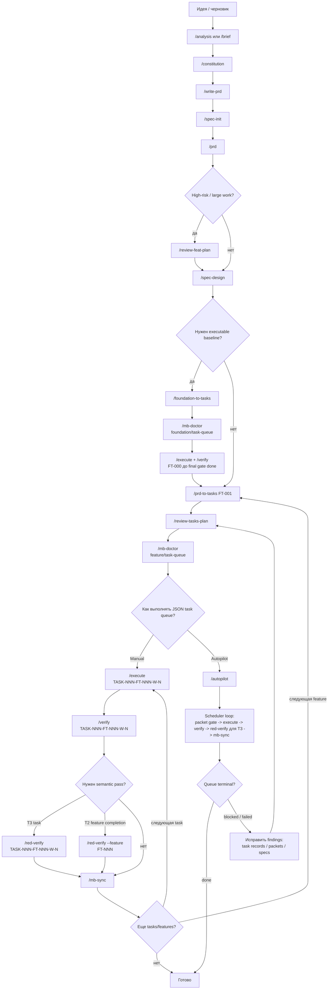

# Greenfield Manual + Autopilot Workflow

Эта Mermaid-схема показывает happy path для greenfield проекта: сначала ручная подготовка Memory Bank и JSON task queue, затем выбор между ручным исполнением задач и `/autopilot`.

