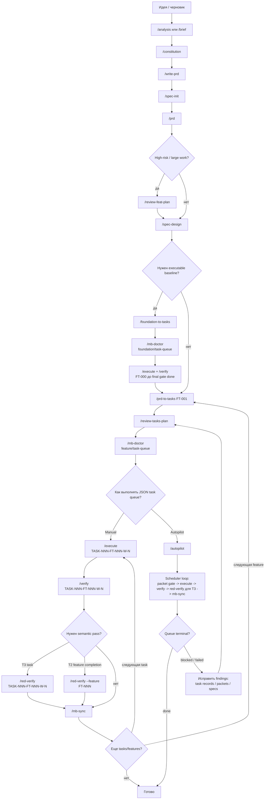

# factory for development


`DevRails 26` - это набор skills и workflow для агентной разработки проектов с долгосрочной SDD orientated памятью и кучей бюрократии ради поддержки автономного режима разработки.

## 📌 Что это

Основные области:

- `.memory-bank/` - знания и состояние проекта: продукт, требования, epics, features, архитектура, task records, индексы и правила работы.
- `.memory-bank/contracts/boundary-map.md` - легкие responsibility/scope boundary notes, которые используются через существующие task поля и `runtime_context`.
- `.memory-bank/packets/` - derivative Execution Packets с компактным runtime context; T2/T3 требуют packet, T0/T1 только при явном `packet_required`.
- `.protocols/` - планы, прогресс и verification по конкретным задачам или features.
- `.tasks/` - runtime evidence, отчеты, handoff-файлы и материалы, которые помогают передавать работу между агентами.
- `.memory-bank/tasks/*.task.json` - task records. Это источник правды для задач.
- `.memory-bank/tasks/index.json` - индекс task records, по которому команды находят и планируют задачи.

## 🗄️ Что дает Memory Bank

Memory Bank помогает вести разработку как повторяемый процесс:

- фиксирует требования, решения и статус задач в репозитории;
- связывает PRD, requirements, epics, features и implementation tasks;
- хранит acceptance criteria, gates, evidence и verification results;
- позволяет выполнять задачи по одной, с явным handoff и проверкой результата;
- поддерживает ручной workflow и автоматические режимы поверх той же task model.

## 🧭 Сценарии использования

- 🌱 **Greenfield**: когда есть идея, черновик или разрозненные требования. Framework помогает довести входные данные до PRD, разложить PRD на requirements, epics, features и tasks, затем пройти реализацию до готового проекта.
- 🏗️ **Brownfield**: когда код уже существует. Framework можно встроить в текущий репозиторий, сначала описать фактическое состояние через `/map-codebase`, а затем планировать изменения через новый PRD или delta к уже описанному baseline.

## 🔄 Классический workflow разработки

Рекомендуемый режим - ручной. В нем проще контролировать входные данные, видеть, какие документы создаются, и проверять каждую задачу отдельно.

```text
идея

  -> Brainstorming       Интервью -> brief.md
  -> Constitution         Принципы проекта и non-negotiables
  -> PRD
  -> /spec-init           Pre-PRD framing для безопасной нарезки
  -> /prd                 requirements, epics, features
  -> /review-feat-plan    для high-risk/large work перед SDD design
  -> /spec-design         обязательный адаптивный SDD backbone
  -> /foundation-to-tasks если нужен
  -> /mb-doctor           readiness gate на foundation/task-queue boundary
  -> execute/verify       foundation до закрытого gate task
  -> /prd-to-tasks        feature design + JSON tasks + required packets
  -> /review-tasks-plan   review JSON task queue
  -> /mb-doctor           readiness gate на feature/task-queue boundary
  -> execute             можно все сразу в авторежиме
  -> verify              + red-verify для T3 task / T2 feature completion
  -> sync
  -> следующая task
```

Та же greenfield-схема в виде карты:



1. `/analysis` или `/brief`

   **Когда:** если входная идея сырая, противоречивая или еще не готова для PRD.

   **Создает/обновляет:** analysis artifacts в `.memory-bank/analysis/`, обычно product brief как вход для `/constitution` и PRD.

   **Дальше:** перейти к `/constitution`, когда достаточно понятно, что нужно строить.

2. `/constitution`

   **Когда:** после product brief или existing PRD context, перед `/write-prd`.

   **Создает/обновляет:** `.memory-bank/constitution.md` с governing principles, Definition of Done, автономностью агентов, human checkpoints и критичными non-negotiables.

   **Дальше:** перейти к `/write-prd`. Если пользователь явно пропускает interview, flow продолжается с `project_principles: framework-default|skipped`, а `/constitution` можно пройти позже.

3. `/write-prd`

   **Когда:** когда есть product brief, черновик требований или уже понятное описание продукта.

   **Создает/обновляет:** PRD с уточненными целями, scope, требованиями, ограничениями и открытыми вопросами.

   **Дальше:** если PRD достаточно ясен, запустить `/spec-init`.

4. `/spec-init`

   **Когда:** после clarified PRD, до `/prd`.

   **Зачем:** проверяет, достаточно ли из PRD понятны actors, scenarios, domain boundaries, lifecycles, constraints и non-goals, чтобы `/prd` мог безопасно вывести requirements, epics и features.

   **Создает/обновляет:** pre-PRD spec framing: `.memory-bank/spec-backbone.md` с `Pre-PRD Spec Status: ready_for_prd|blocked`, чистый registry `.memory-bank/spec-index.md`, а при evidence или явных gaps — `user-scenarios.md`, `domains/<domain>.md`, `invariants.md`, optional `contracts/boundary-map.md` и `states/lifecycle-map.md`. При PASS состояние означает: pre-PRD framing готов для `/prd`, а Global Backbone Status намеренно ожидает `/spec-design`. Если PRD уже содержит достаточные evidence, `/spec-init` может просто сослаться на PRD вместо отдельного файла. Не проводит architecture interview, не проектирует full architecture и не создает features/tasks.

   **Дальше:** запустить `/prd` только при `ready_for_prd`; при `blocked` сначала уточнить PRD/framing gaps.

5. `/prd`

   **Когда:** когда PRD готов к разложению на структуру Memory Bank.

   **Создает/обновляет:** `.memory-bank/product.md`, `.memory-bank/requirements.md`, `.memory-bank/epics/`, `.memory-bank/features/` и связанные индексы.

   **Дальше:** для high-risk/large work запустить `/review-feat-plan`, затем обязательный `/spec-design`. Для маленьких независимых T0/T1 features `/spec-design` создает minimal backbone и помечает лишние области `not_applicable`; для shared/T2/T3 concerns проводит архитектурный checkpoint. Если нужен executable baseline, сначала пройти `/foundation-to-tasks` и закрыть foundation gate. Затем выбрать feature для декомпозиции. Если она заблокирована неясностями, сначала использовать `/clarify-feature FT-001`; затем `/prd-to-tasks FT-001`.

6. `/spec-design`

   **Когда:** после `/prd`, всегда перед `/prd-to-tasks`. Это обязательный gate, но не обязательная тяжелая фаза.

   **Создает/обновляет:** `spec-backbone` с Global Backbone Status и Backbone Area Matrix, чистый `spec-index` только как registry, SDD backbone specs по необходимости и `.memory-bank/foundation.md`, если нужен Foundation Dev Path. По умолчанию держит architecture в одном `architecture/system-architecture.md` с секциями source-of-truth/module-boundaries; отдельные `architecture/source-of-truth.md`, `architecture/module-boundaries.md` или boundary-файлы создаются только при явном выборе split/реальной сложности. Детальные API/state/message contracts живут в `contracts/`, `states/`, `domains/`, `tech-specs/`. Потребляет pre-PRD framing из `/spec-init`, не создает task records.

   **Дальше:** если foundation required, запустить `/foundation-to-tasks` и закрыть final foundation gate; иначе выбрать feature и запустить `/prd-to-tasks FT-001`.

7. `/foundation-to-tasks`

   **Когда:** после `/spec-design`, если `.memory-bank/foundation.md` говорит `Foundation Required: true`.

   **Создает/обновляет:** `REQ-000`, `.memory-bank/features/FT-000-foundation.md`, `.protocols/FT-000/*`, `.memory-bank/tasks/plans/IMPL-FT-000.md`, normal JSON `TASK-NNN-FT-000-W-N` records для foundation и final foundation gate task. Свежий bootstrap это не создает.

   **Дальше:** `/mb-doctor` на foundation/task-queue boundary, затем `/execute`/`/verify` foundation tasks до `done` у final gate task.

8. `/clarify-feature FT-001`

   **Когда:** только если конкретная feature содержит blocker, `TBD`, `TODO`, `NEEDS CLARIFICATION` или другой marker, который мешает нарезать задачи.

   **Создает/обновляет:** уточнения по feature и ее clarification status.

   **Дальше:** после снятия blocker запустить `/prd-to-tasks FT-001`.

9. `/prd-to-tasks FT-001`

   **Когда:** когда feature можно разложить на implementation tasks.

   **Создает/обновляет:** feature-level SDD design status/spec links, `.protocols/FT-001/plan.md`, `.protocols/FT-001/decision-log.md`, `.memory-bank/tasks/plans/IMPL-FT-001.md`, product task records в `.memory-bank/tasks/*.task.json`, индекс `.memory-bank/tasks/index.json` и required initial Execution Packets для T2/T3 и явных T0/T1 packet requirements. Если foundation required, product tasks зависят от final foundation gate.

   **Дальше:** после декомпозиции текущей feature запустить `/review-tasks-plan`, затем `/mb-doctor` на feature/task-queue boundary и перейти к `/execute TASK-NNN-FT-NNN-W-N`; `/verify TASK-NNN-FT-NNN-W-N` выполняется после реализации конкретной задачи.

10. `/mb-doctor`

   **Когда:** после того как feature полностью разложена на task records и required packets, перед стартом execution по этой feature.

   **Создает/обновляет:** report readiness findings; не заменяет `/verify` и не исполняет tasks.

   **Дальше:** исправить findings или перейти к `/execute TASK-NNN-FT-NNN-W-N`.

11. `/execute TASK-NNN-FT-NNN-W-N`

   **Когда:** для реализации одной конкретной задачи из task record.

   **Создает/обновляет:** код или документацию по scope задачи, protocol state в `.protocols/TASK-NNN-FT-NNN-W-N/`, evidence и handoff в `.tasks/TASK-NNN-FT-NNN-W-N/`.

   **Дальше:** запустить `/verify TASK-NNN-FT-NNN-W-N`.

12. `/verify TASK-NNN-FT-NNN-W-N`

   **Когда:** после реализации задачи.

   **Создает/обновляет:** verification evidence, verdict `PASS` или `FAIL`, task/protocol state по результату проверки.

   **Дальше:** если задача сложная или рискованная, запустить `/red-verify TASK-NNN-FT-NNN-W-N`; иначе перейти к `/mb-sync`.

13. `/red-verify TASK-NNN-FT-NNN-W-N`

   **Когда:** обязательно для T3 task closure; опционально для T2 task closure; обязательно как `/red-verify --feature FT-*` перед T2 feature completion. Feature-level verdict записывается в сам feature doc. Особенно полезно там, где обычные tests могут пройти, но решение может быть неверным по смыслу.

   **Создает/обновляет:** semantic verification report и semantic verdict.

   **Дальше:** при проблемах вернуть задачу в доработку; при успешной проверке перейти к `/mb-sync`.

14. `/mb-sync`

   **Когда:** после результата задачи, особенно если менялись требования, task status, changelog, RTM или durable Memory Bank docs.

   **Создает/обновляет:** индексы Memory Bank, lifecycle/RTM notes, changelog, task-record consistency и ссылки на evidence.

   **Дальше:** выбрать следующую задачу или feature.

15. Повторять цикл

    **Когда:** пока features и tasks не доведены до нужного состояния.

    **Создает/обновляет:** последовательные изменения в продукте, документах, task records и evidence.

    **Дальше:** продолжать `/prd-to-tasks` для следующих features или `/execute` для следующих tasks. Использовать `/spec-improve` и `/mb-packet` только для repair/refresh вне happy path.

## 🛠️ Команды вне основного ручного цикла

- `/cold-start` - выбирает стартовый сценарий для нового или существующего репозитория: greenfield, brownfield, skeleton-only.
- `/mb-init` - создает skeleton Memory Bank, `.tasks/`, `.protocols/`, `AGENTS.md` и project command proxies.
- `/spec-improve` - standalone repair/refresh feature-level SDD design, когда нужно обновить design без task decomposition.
- `/mb-packet` - repair/refresh derivative Execution Packet после task/spec изменений или readiness finding; initial required packets создает `/prd-to-tasks`.
- `/map-codebase` - описывает существующий код как as-is baseline в Memory Bank.
- `/review-feat-plan` - fresh-context review PRD/requirements/epics/features до `/spec-design`.
- `/review-tasks-plan` - fresh-context review JSON task queue после `/prd-to-tasks`.
- `/mb-garden` - обслуживает Memory Bank: lint, чистка, устранение drift, архивирование.
- `/mb-doctor` - deterministic readiness gate для autopilot/autonomous runs.
- `/mb-harness` - помогает настроить чистые сессии, профили и проверочные команды.
- `/autopilot` - автономно проходит уже созданную JSON task queue.
- `/autonomous` - ведет полный unattended flow от PRD до terminal state.
- `/discuss` - проясняет неизвестные и противоречия перед реализацией.
- `/add-tests` - добавляет или расширяет тесты вокруг выбранной области.
- `/find-skills` - ищет релевантные skills среди установленных и доступных.

## 🚀 Установка и запуск

Скачайте этот репозиторий, перейдите в его папку и запустите скрипт автоустановки:

```bash
node scripts/install-framework.mjs
```

Интерактивный installer позволит выбрать нужную папку проекта из списка,
установит команды memobank и создаст или синхронизирует skeleton Memory Bank в
выбранном репозитории.

Если Memory Bank уже был развернут, installer обновит generated commands,
proxy skills, runtime scripts и может синхронизировать `AGENTS.md`. Для
существующего проекта лучше запускать установку в git-репозитории или заранее
сделать копию `AGENTS.md`, чтобы при необходимости посмотреть diff.

После установки используйте `/cold-start` или начните ручной цикл:

```text
/analysis -> /brief -> /constitution -> /write-prd -> /spec-init -> /prd -> /review-feat-plan for high-risk/large work -> /spec-design -> /foundation-to-tasks if required -> /mb-doctor at foundation/task-queue boundary -> execute/verify FT-000 until foundation gate done -> /prd-to-tasks FT-001 -> /review-tasks-plan -> /mb-doctor at feature/task-queue boundary -> /execute first indexed TASK -> /verify same TASK -> /mb-sync
```

Автоматические режимы стоит включать после того, как PRD, features и task records уже понятны. `/autopilot` работает по готовой JSON task queue, а `/autonomous` берет на себя более длинный unattended flow. Оба режима требуют usable packets для T2/T3 и для T0/T1 только при `runtime_context.packet_required: true`.

## 📚 Подробная механика

Подробное описание установки, source-only packaging, структуры Memory Bank, task model, tier policy, command reference и проверок находится в [howItWorks.md](howItWorks.md).
