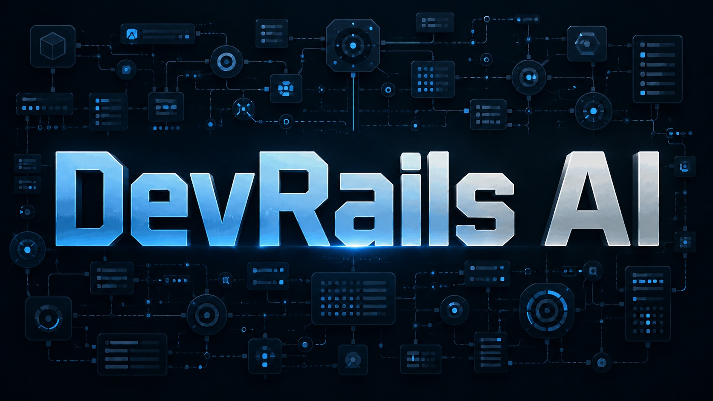

# factory for development



`DevRails 26` - это фреймворк, который содержит набор skills и workflow для агентной разработки проектов с долгосрочной SDD orientated памятью и кучей бюрократии ради надежной долгосрочной поддержки проекта Агентами. Ориентирован на упряжки Claude CLI / Codex CLI. 


## 📌 Что это

Основные области:

- `.memory-bank/` - знания и состояние проекта: продукт, требования, epics, features, архитектура, task records, индексы и правила работы.
- `.memory-bank/architecture/system-architecture.md#Architecture Spine` - короткие `AD-*` rules для shared-boundary, contract, state/data/runtime/security или strict pressure.
- `.memory-bank/contracts/boundary-map.md` - легкие responsibility/scope boundary notes, которые используются через существующие task поля и `runtime_context`.
- `.memory-bank/packets/` - derivative Execution Packets с компактным runtime context; T2/T3 требуют packet, T0/T1 только при явном `packet_required`.
- `.memory-bank/behavior-specs/` - optional JSON `given / when / then` примеры для важных или неоднозначных feature behaviors; tasks ссылаются на них только через `source_artifacts`.
- `.protocols/` - планы, прогресс и verification по конкретным задачам или features.
- `.tasks/` - runtime evidence, отчеты, handoff-файлы и материалы, которые помогают передавать работу между агентами.
- `.memory-bank/tasks/*.task.json` - task records. Это источник правды для задач.
- `.memory-bank/tasks/index.json` - индекс task records, по которому команды находят и планируют задачи.

## 🗄️ Что дает Memory Bank

Memory Bank помогает вести разработку как повторяемый процесс:

- фиксирует требования, решения и статус задач в репозитории;
- связывает PRD, requirements, epics, features и implementation tasks;
- хранит acceptance criteria, gates, evidence и verification results;
- позволяет выполнять задачи по одной, с явным handoff и проверкой результата;
- поддерживает ручной workflow и автоматические режимы поверх той же task model.

## 🧭 Сценарии использования

- 🌱 **Greenfield**: когда есть идея, черновик или разрозненные требования. Framework помогает довести входные данные до PRD, разложить PRD на requirements, epics, features и tasks, затем пройти реализацию до готового проекта.
- 🏗️ **Brownfield**: когда код уже существует. Framework можно встроить в текущий репозиторий, сначала описать фактическое состояние через `/map-codebase`, а затем планировать изменения через новый PRD или delta к уже описанному baseline.

## 🔄 Workflow разработки

Рабочий процесс DevRails состоит из трех фаз. Их можно проходить вручную под контролем оператора или частично отдавать агентам, но порядок важен: сначала понять, что строим, затем зафиксировать план и спецификации, затем исполнять задачи.

### 1. 🧠 Мозговой штурм и формирование ТЗ

На этой фазе сырой запрос превращается в понятный вход для PRD. Если идея еще расплывчатая, запускают `/brainstorm`: агент задает вопросы, помогает разложить варианты, фиксирует выбранные и отброшенные направления в `.memory-bank/analysis/brainstorming/`. Если концепт уже понятен, можно сразу идти в `/brief` и оформить короткий Product Brief в `.memory-bank/analysis/product-brief.md`.

После brief обычно проходит `/constitution`, если принципы проекта еще не `ratified|partial`. Здесь фиксируются правила работы агентов, Definition of Done, human checkpoints и non-negotiables. Затем `/write-prd` нормализует Product Brief, внешний PRD или текст требований в `.memory-bank/prd.md`. На выходе этой фазы у проекта есть ясное ТЗ: что делаем, для кого, какие ограничения, что не входит в scope и какие вопросы еще блокируют работу.

### 2. 🧩 Создание плана разработки и спецификаций

Эта фаза превращает PRD в структуру разработки. `/spec-init` сначала проверяет, достаточно ли понятны actors, сценарии, доменные границы, lifecycle и non-goals, чтобы не нарезать продукт неправильно. Если PRD уже содержит нужные факты, команда только связывает их в `spec-backbone`; если есть пробелы, создает минимальные framing specs, например user scenarios, domain notes, invariants или boundary hints.

Затем `/prd` создает функциональный слой Memory Bank: `product.md`, `requirements.md`, epics и features. Это не task queue, а функциональные спецификации уровня продукта: требования, user-facing features, acceptance criteria и traceability.

После этого обязателен `/spec-design`. Он формирует SDD backbone: глобальные технические решения, source-of-truth, границы модулей, контракты, data/state/runtime/security/testing решения там, где они реально нужны. Для простых проектов backbone может быть минимальным с явными `not_applicable`; для сложных зон появляется Architecture Spine с `AD-*` rules и ссылки на authoritative specs в `architecture/`, `contracts/`, `domains/`, `states/`, `testing/` или `runbooks/`.

Если до продуктовых features нужен проверенный executable baseline, `/spec-design` фиксирует Foundation Dev Path, а `/foundation-to-tasks` создает `FT-000`: reserved pseudo-feature для walking skeleton. `FT-000` не является продуктовой фичей. Его задачи доказывают, что проект запускается, тестируется и имеет минимальный вертикальный путь. Product tasks создаются только после закрытого final foundation gate.

Когда feature готова к реализации, `/prd-to-tasks FT-<NNN>` делает feature-level SDD design, при необходимости создает feature tech-specs и до трех optional behavior specs в `.memory-bank/behavior-specs/`. Behavior specs - это короткие JSON `given / when / then` примеры для неоднозначного поведения; они помогают агентам не сузить смысл acceptance criteria, но не становятся отдельным registry или verification gate. Затем команда создает implementation plan, JSON task records и required Execution Packets для T2/T3.

Перед исполнением task queue проходит review: `/review-feat-plan` проверяет PRD/REQ/EP/FT перед SDD design для high-risk/large work, а `/review-tasks-plan FT-<NNN>` проверяет уже нарезанные задачи. `/mb-doctor` нужен как readiness gate для foundation, T3, complex T2 и handoff в `/autopilot` или `/autonomous`; для простых manual T0/T1 он не является обязательной привычкой.

### 3. ⚙️ Имплементация кодовой базы

Имплементация идет по JSON task records из `.memory-bank/tasks/index.json` и `.memory-bank/tasks/TASK-*.task.json`. У каждой задачи есть tier `T0|T1|T2|T3`; именно tier определяет глубину протокола, verification и red-verification.

В режиме ручного контроля оператор выбирает следующую задачу и запускает `/execute TASK-NNN-TN-FT-NNN-WN`. Это не значит, что код пишется руками: агент реализует задачу, но человек контролирует порядок, scope и моменты проверки. Для T0/T1 допустим compact evidence и иногда закрытие прямо в `/execute`, если есть explicit owner и нет признаков T2/T3. Для T2 нужен `/verify`; для T3 нужен `/verify` и `/red-verify`. Для T2 feature completion отдельно нужен `/red-verify --feature FT-<NNN>`, потому что обычные тесты могут пройти, а смысл feature все равно может быть реализован неправильно.

Если task queue уже подготовлена, можно запустить `/autopilot`. Это scheduler/executor для существующих JSON tasks: он сам продвигает `planned -> ready -> in_progress`, запускает execute/verify/red-verify по tier policy, делает `/mb-sync`, блокирует dependents при проблемах и идет дальше. `/autopilot` съест заметно больше токенов, потому что постоянно перечитывает task records, packets, evidence, запускает gates и держит scheduler state, но он старается реализовать всю подготовленную очередь самостоятельно. Для полного unattended пути от PRD до terminal state используется `/autonomous`, а не `/autopilot`.

После реализации кода начинается проверка. Внутри workflow тесты задаются в task `gates`, `verification_targets`, feature acceptance criteria и testing docs. Минимальный путь: выполнить команды тестов из task gates, записать evidence в `task.verify` и `.protocols/<TASK>/`, затем запустить `/verify`. Для серьезных изменений T2/T3 дополнительно нужны linked SDD specs, required packets и semantic checks. Если тестов недостаточно, используйте `/add-tests` для unit/integration/e2e покрытия вокруг измененной области. На границах wave/feature выполняется `/mb-sync`, а перед autonomous/autopilot progression - `mb-lint` и `/mb-doctor --strict`.

Схема greenfield happy path вынесена отдельно: [GREENFIELD_WORKFLOW.md](GREENFIELD_WORKFLOW.md). Подробная механика всех gates описана в [howItWorks.md](howItWorks.md).

## 🛠️ Описание команд

- 🚦 `/cold-start` - выбирает стартовый сценарий после skeleton creation: greenfield, brownfield, skeleton-only. Если `.memory-bank/` еще нет, сначала используйте `/mb-init` или installer bootstrap.
- 🧱 `/mb-init` - создает skeleton Memory Bank, `.tasks/`, `.protocols/`, `AGENTS.md` и runtime scripts.
- 🧠 `/brainstorm` - проводит мозговой штурм для сырой идеи и пишет brainstorming report в `.memory-bank/analysis/brainstorming/`.
- 📝 `/brief` - оформляет Product Brief как входной контракт для `/constitution` и `/write-prd`.
- ⚖️ `/constitution` - фиксирует governing principles, Definition of Done, autonomy rules, human checkpoints и non-negotiables.
- 📄 `/write-prd` - превращает brief, внешний PRD или текст требований в clarified `.memory-bank/prd.md`.
- 🧭 `/spec-init` - готовит pre-PRD framing: сценарии, доменные границы, lifecycle hints, constraints и route map для `/prd`.
- 🧾 `/prd` - создает функциональные спецификации Memory Bank: product, requirements, epics, features, testing index и traceability.
- 🔍 `/review-feat-plan` - fresh-context review PRD/requirements/epics/features перед SDD design для high-risk/large work.
- 🏛️ `/spec-design` - обязательный SDD backbone gate: архитектурные решения, boundaries, contracts, Architecture Spine и Foundation Dev Path decision.
- 🧪 `/foundation-to-tasks` - создает `FT-000` foundation task queue, если нужен executable baseline перед продуктовыми features.
- ❓ `/clarify-feature FT-<NNN>` - снимает feature-level blockers перед task decomposition.
- 🧩 `/prd-to-tasks FT-<NNN>` - делает feature-level SDD design, optional behavior specs, implementation plan, JSON tasks и required packets.
- 🔎 `/review-tasks-plan FT-<NNN>` - проверяет task plan текущей feature; для scheduler handoff нужен `APPROVE` по каждой task-linked product feature.
- 🩺 `/mb-doctor` - deterministic readiness gate поверх `mb-lint`; strict mode обязателен перед autonomous/autopilot scheduler progression.
- 📦 `/mb-packet` - repair/refresh derivative Execution Packet после task/spec изменений или readiness finding.
- ⚙️ `/execute TASK-NNN-TN-FT-NNN-WN` - реализует одну задачу по JSON task record, tier policy и packet/spec context.
- ✅ `/verify TASK-NNN-TN-FT-NNN-WN` - проверяет acceptance criteria, gates и evidence по задаче.
- 🧯 `/red-verify TASK-NNN-TN-FT-NNN-WN` - adversarial semantic verification для T3 task closure и важных смысловых рисков.
- 🧯 `/red-verify --feature FT-<NNN>` - semantic pass перед завершением T2 feature.
- 🔄 `/mb-sync` - синхронизирует durable Memory Bank state, RTM, changelog, task consistency и evidence links на boundary.
- 🧪 `/add-tests` - добавляет или расширяет unit/integration/e2e тесты вокруг выбранной области.
- 🗺️ `/map-codebase` - описывает существующий код как as-is baseline в Memory Bank для brownfield проектов.
- 🛠️ `/spec-improve` - standalone repair/refresh feature-level SDD design без task decomposition.
- 🤖 `/autopilot` - автономно исполняет уже подготовленную JSON task queue.
- 🚀 `/autonomous` - ведет полный unattended flow от PRD до terminal state.
- 🧹 `/mb-garden` - обслуживает Memory Bank: lint, чистка, устранение drift, архивирование.
- 🧰 `/mb-harness` - помогает настроить чистые сессии, профили и проверочные команды.
- 💬 `/discuss` - проясняет неизвестные и противоречия перед реализацией.
- 🔎 `/find-skills` - ищет релевантные skills среди установленных и доступных.

## 🚀 Установка и запуск

Скачайте этот репозиторий, перейдите в его папку и запустите скрипт автоустановки:

```bash
node scripts/install-framework.mjs
```

Интерактивный installer позволит выбрать нужную папку проекта из списка,
установит команды DevRails 26 и создаст или синхронизирует skeleton Memory Bank в
выбранном репозитории.

Если Memory Bank уже был развернут, installer обновит runtime command skills,
runtime scripts и может синхронизировать `AGENTS.md`. Для
существующего проекта лучше запускать установку в git-репозитории или заранее
сделать копию `AGENTS.md`, чтобы при необходимости посмотреть diff.

После bootstrap-установки используйте `/cold-start` или начните ручной цикл.
Если запускали только install-only и `.memory-bank/` еще нет, сначала выполните
`/mb-init`.

Ручной greenfield flow описан выше в разделе
`Workflow разработки`; Mermaid-карта вынесена в
[GREENFIELD_WORKFLOW.md](GREENFIELD_WORKFLOW.md).

Автоматические режимы стоит включать после того, как PRD, features и task records уже понятны. `/autopilot` работает по готовой JSON task queue, а `/autonomous` берет на себя более длинный unattended flow. Оба режима требуют usable packets для T2/T3 и для T0/T1 только при `runtime_context.packet_required: true`.

## 📚 Подробная механика

Подробное описание установки, source-only packaging, структуры Memory Bank, task model, tier policy, command reference и проверок находится в [howItWorks.md](howItWorks.md).
